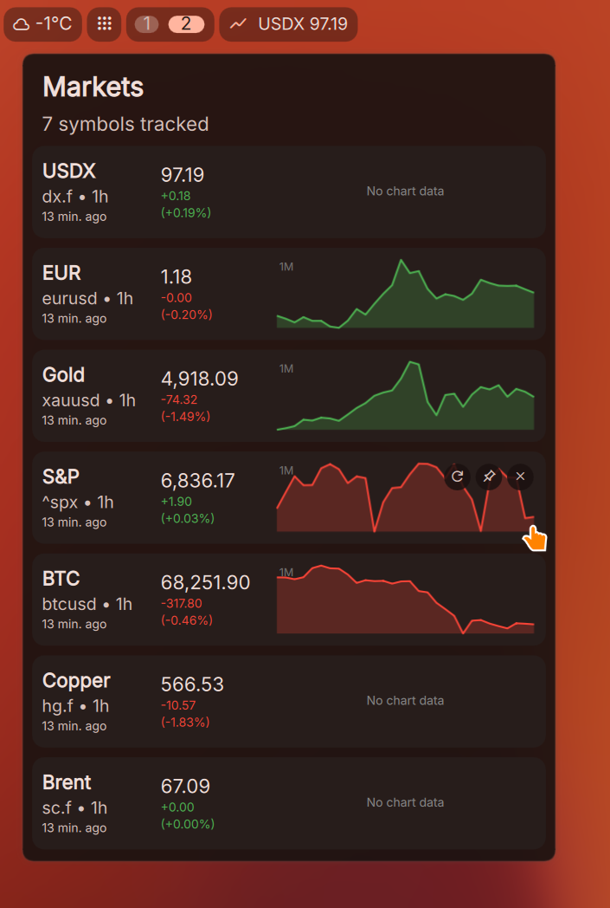
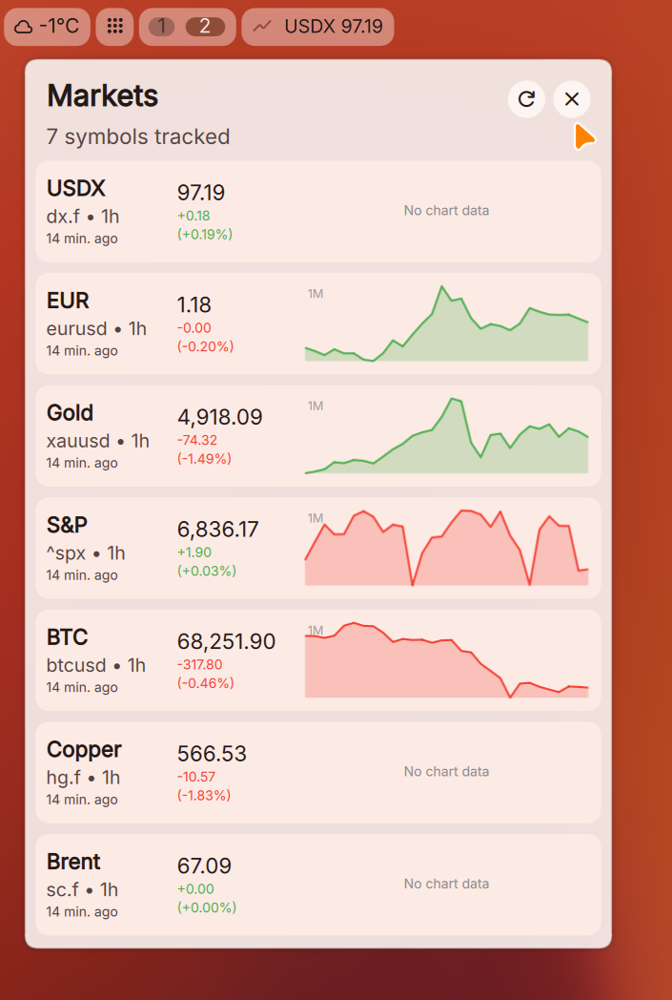
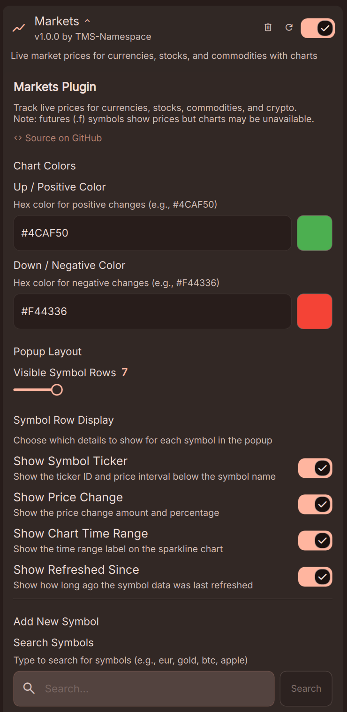
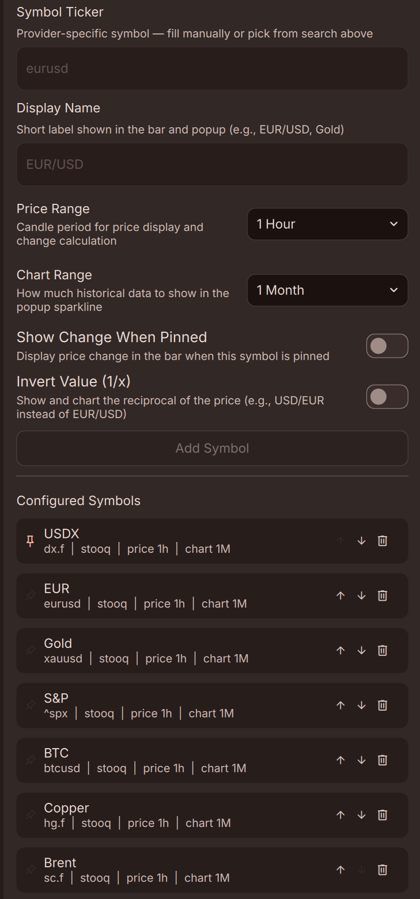

# Markets Plugin for DMS

A [DankMaterialShell](https://github.com/dankmaterial/DMS) widget plugin that displays near-live market prices and charts directly in your desktop shell.

| Dark Theme | Light Theme |
|:---:|:---:|
|  |  |

## Features

- **Pin to bar** — display live prices for selected symbols directly in `DankBar`.
- **Popup panel** — list showing name, price, change percentage, and `sparkline` charts.
- **Symbol search** — find and add symbols by keyword via provider search `API`.
- **Per-symbol configuration** — independent price interval, chart range, change display, and price inversion.
- **Custom colors** — configurable up/down color indicators.
- **Reorder & edit** — rearrange symbol order, click to edit, hover to pin or delete.
- **Adjustable popup height** — set the number of visible rows.
- **Intelligent fetching** — staggered data requests with retry logic to avoid rate limiting.

| Settings (1) | Settings (2) |
|:---:|:---:|
|  |  |

## Requirements

- `DMS` ≥ 1.2.0
- `curl` installed and available in `$PATH`
- Internet access

## Data Providers

Currently supported only one provider: [Stooq](https://stooq.com) that has public and free `CSV` endpoints, no `API` key required.

> **Limitation:** `Stooq` does not provide historical data for futures symbols (tickers matching `*.f`) through its public `API`. Price data will load, but charts will be unavailable for these symbols.

## Privacy

- No endpoints are contacted other than the configured data provider.
- ~~struck-through All requests are made without cookies to minimize tracking potential.~~ (see version 1.0.1 in [Version History](#version-history))
- `Stooq` is operated from `Poland` and is presumably `GDPR`-compliant. See their [Privacy & Cookie Policy](https://stooq.com/privacy/) and [Terms of Service](https://stooq.com/terms.html).

## Version History

- v1.0.1 :
  - Fixed the issue with charts for previously working symbols, are not displayed (Unfortunately, `Stooq` now requires using cookies).
  - Added logging capability.
  - Refactoring.
- v1.0.0 :
  - Initial version.

## Disclaimers

- The developer has no affiliation with any data provider.
- This plugin was vibe-coded under my supervision as a software engineer.
