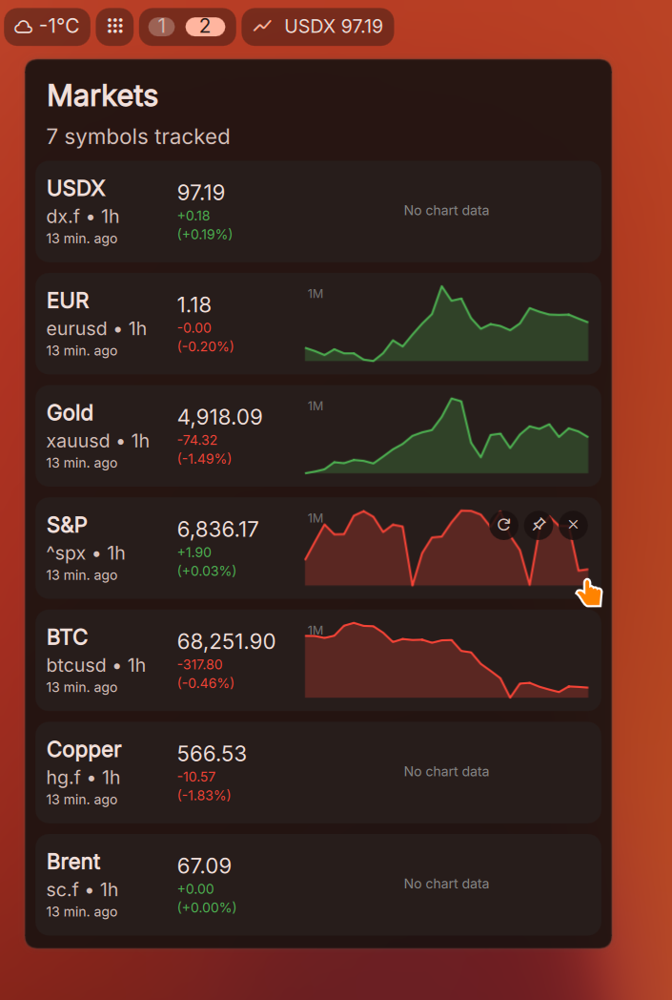
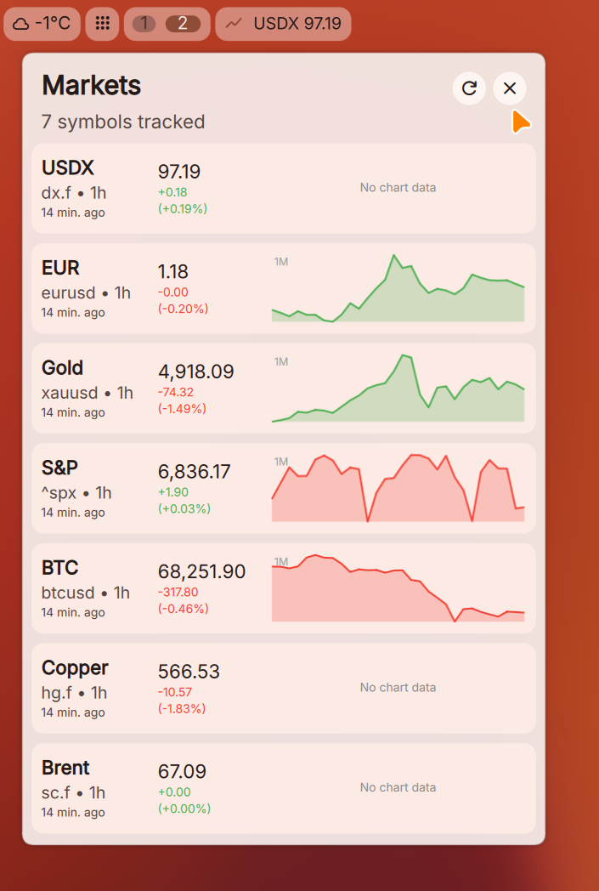
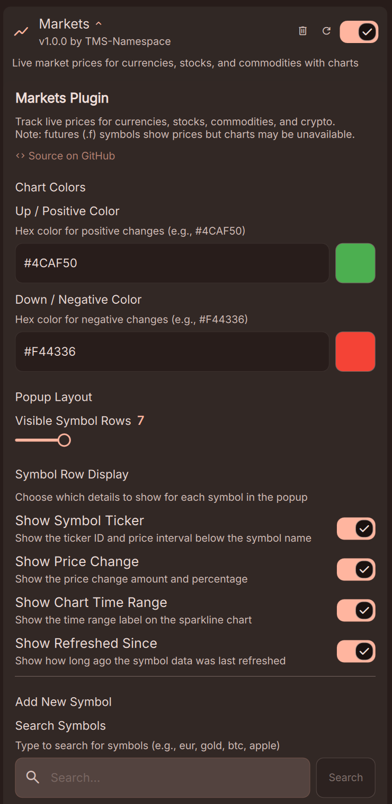
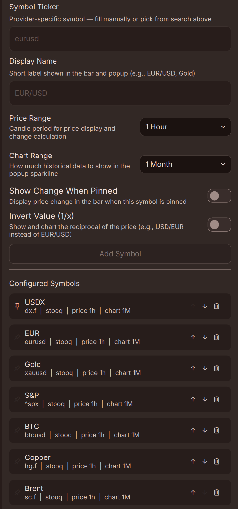

# Markets Plugin for DMS

A [DankMaterialShell](https://github.com/dankmaterial/DMS) widget plugin that displays near-live market prices and charts directly in your desktop shell, using free to obtain `API` key (No registration is required).

| Dark Theme | Light Theme |
|:---:|:---:|
|  |  |

## Features

- **Pin to bar** — display live prices for selected symbols directly in `DankBar`.
- **Popup panel** — list showing name, price, change percentage, and `sparkline` charts.
- **Manual symbol entry** — open Stooq in your browser, then add the provider symbol manually.
- **Per-symbol configuration** — independent price interval, chart range, change display, and price inversion.
- **Custom colors** — configurable up/down color indicators.
- **Reorder & edit** — rearrange symbol order, click to edit, hover to pin or delete.
- **Adjustable popup height** — set the number of visible rows.
- **Intelligent fetching** — staggered data requests with retry logic to avoid rate limiting.

| Settings (1) | Settings (2) |
|:---:|:---:|
|  |  |

## Requirements

- `DMS` ≥ 1.2.0
- `curl` and `nodejs` installed and available in `$PATH`
- Internet access
- Existing valid `Stooq` `API` key.

## Data Providers

Currently supported only one provider: [Stooq](https://stooq.com) that publishes `CSV` quotes for a wide range of instruments. An API key is required.


### Stooq API Key Status

Stooq's previous API-key request page, `https://stooq.com/q/d/?s=eurusd&get_apikey`, currently returns an empty page. Existing valid keys can still be pasted in plugin **Settings**, but new key generation is not currently available through the old flow.

> **Limitation:** Some Stooq symbols shown on the website do not return CSV data through the public API. If a symbol stays empty in the widget, open Stooq in your browser and try the cash/index variant shown there.

## Privacy

- No endpoints are contacted other than the configured data provider.
- Stooq fetches use a local cookie jar for Stooq's browser-verification challenge.
- `Stooq` is operated from `Poland` and is presumably `GDPR`-compliant. See their [Privacy & Cookie Policy](https://stooq.com/privacy/) and [Terms of Service](https://stooq.com/terms.html).
- The API key is obfuscated and stored locally on your disk.

## Version History

- v1.0.2 :
  - Now `Stooq` requires `API` key to provide historic data, updated backend and widget settings to support `API` key.
- v1.0.1 (Unpublished, due to following changes from `Stooq` provider):
  - Fixed the issue with charts for previously working symbols, are not displayed (Unfortunately, `Stooq` now requires using cookies).
  - Added logging capability.
  - Refactoring.
- v1.0.0 :
  - Initial version.

## Install

### Method 1

In DMS:

1. Open `Settings -> Plugins`
2. Click `Scan for Plugins`
3. Enable `GitHub Inbox`
4. Add widget to DankBar

### Method 2

Or clone repo, and run (this will add `Symlink` to plugin folder):

```bash
chmod +x Support/setup-symlink.sh
Support/setup-symlink.sh
```

## Disclaimers

- The developer has no affiliation with any data provider.
- This plugin was vibe-coded under my supervision as a software engineer.
