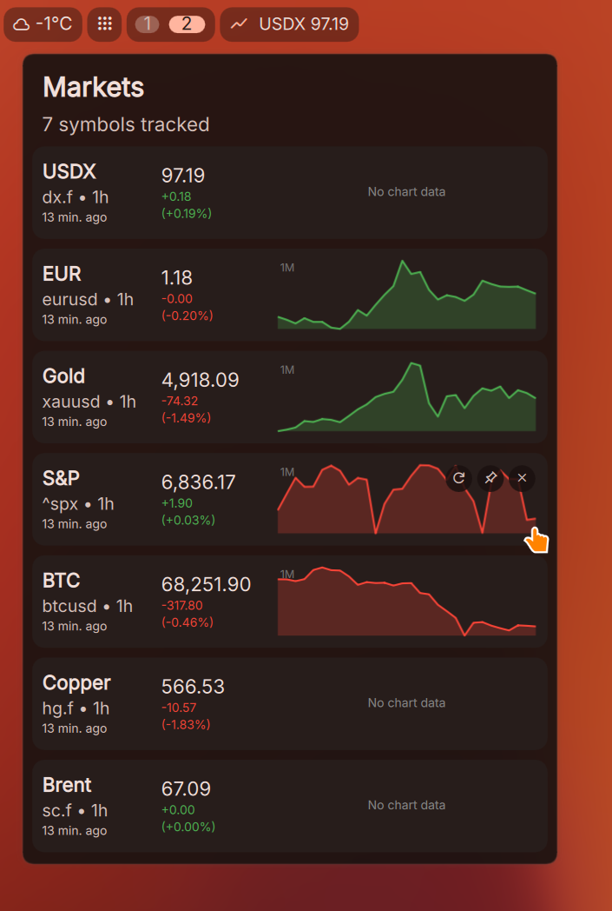
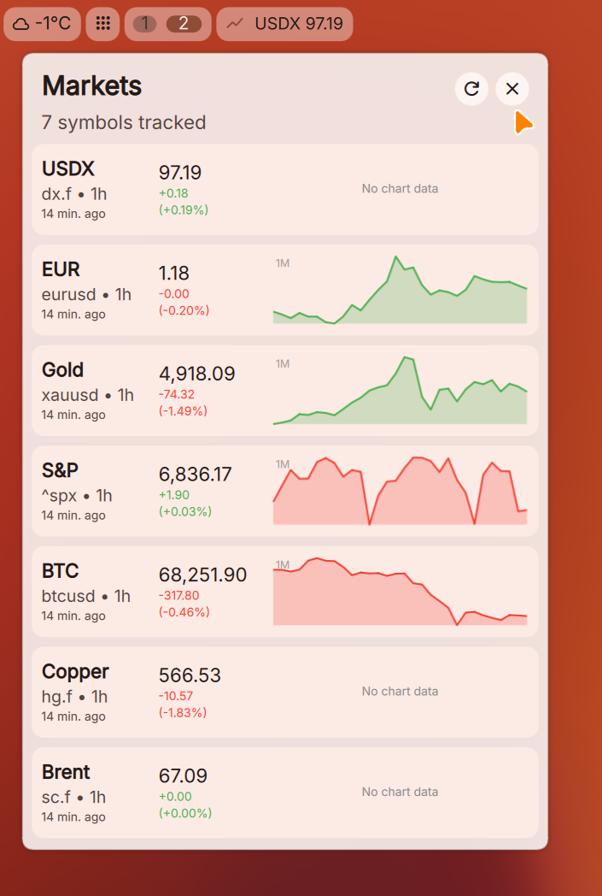
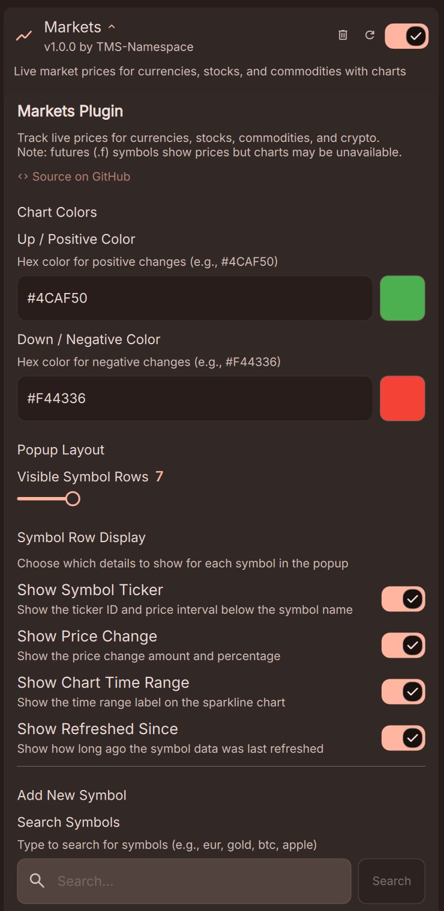
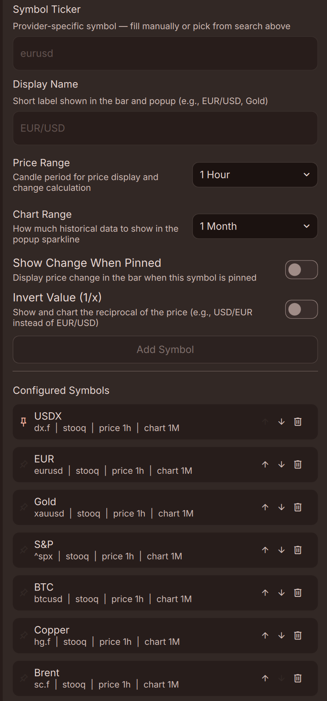

# Markets Plugin for DMS

A [DankMaterialShell](https://github.com/dankmaterial/DMS) widget plugin that displays near-live market prices and charts directly in your desktop shell through configurable market data providers.

| Dark Theme | Light Theme |
|:---:|:---:|
|  |  |

## Features

- **Pin to bar** — display live prices for selected symbols directly in `DankBar`.
- **Popup panel** — list showing name, price, change percentage, and `sparkline` charts.
- **Manual symbol entry** — open the selected provider in your browser, then add the provider symbol manually.
- **Per-symbol configuration** — independent data provider, price interval, chart range, change display, and price inversion.
- **Custom colors** — configurable up/down color indicators.
- **Reorder & edit** — rearrange symbol order, click to edit, hover to pin or delete.
- **Adjustable popup height** — set the number of visible rows.
- **Intelligent fetching** — staggered data requests with retry logic to avoid rate limiting.

| Settings (1) | Settings (2) |
|:---:|:---:|
|  |  |

## Requirements

- `DMS` ≥ 1.2.0
- `curl` installed and available in `$PATH`
- `bash` installed and available in `$PATH`
- `Node.js` only when `Stooq` provider is used (currently disabled).
- Internet access

## Data Providers

Currently supported providers:

- [Yahoo Finance](https://finance.yahoo.com) — The current default. No credentials required. Example symbols: `EURUSD=X`, `BZ=F`, `HG=F`, `DX-Y.NYB`, `^GSPC`.
- [Stooq](https://stooq.com) — Currently disabled, due to unstable `API`. Publishes `CSV` quotes for a wide range of instruments.

  > **Limitation:** Some Stooq symbols (usually futures that has symbols of `*.f` format) shown on the website do not return CSV data through the public API. If a symbol stays empty in the widget, open Stooq in your browser and try the cash/index variant shown there (i.e. symbols of `*.i` or `*.c` format).

## Privacy

- URLs are passed as separate process arguments.
- `Yahoo Finance` provider quires `query1.finance.yahoo.com`, clicking a chart or symbol search opens `finance.yahoo.com` in your browse.
- Responses are written to `mktemp` temporary files and cleaned up when the fetch script exits.
- Stooq contacts `stooq.com`, and stores a cookie jar at `~/.cache/dms-markets-stooq.cookies`, and uses `Node.js` for a browser verification proof-of-work challenge.
- No endpoints are contacted other than the one related to the configured provider.
- Provider credentials (currently only `Stooq`) are stored locally in plugin settings, with simple and reversible XOR obfuscation.
- `Stooq` is operated from `Poland` and is presumably `GDPR`-compliant. See their [Privacy & Cookie Policy](https://stooq.com/privacy/) and [Terms of Service](https://stooq.com/terms.html).
- `Yahoo's` [Privacy Policy](https://legal.yahoo.com/us/en/yahoo/privacy/index.html), [Yahoo Finance privacy practices](https://legal.yahoo.com/us/en/yahoo/privacy/products/mediaservices/index.html#yahoo-finance), and [Terms of Service](https://legal.yahoo.com/us/en/yahoo/terms/otos/index.html).

## Version History

- v1.0.4 :
  - A maintenance release with small fixes, to comply with `DMS` comments [published here](https://github.com/AvengeMedia/dms-plugin-registry/issues/555#issuecomment-5899885512) and [here](https://github.com/AvengeMedia/dms-plugin-registry/pull/990#issuecomment-5947902007).
  - Enforce all command execution via `bash` to not break when user's default shell is not `bash`.
- v1.0.3 :
  - `Stooq` changed their `API` yet again, and broken data fetching.
  - Added `Yahoo Finance` provider as a, probably less privacy respecting, but working alternative for `Stooq`.
  - Disabled `Stooq` till they stabilize their `API`.
  - If you previously configured `Stooq` symbols, delete them and re-add the same markets using another provider. Provider symbols can differ, so use the symbol search link in settings to find the correct Yahoo Finance symbol.
- v1.0.2 :
  - Now `Stooq` requires `API` key to provide historic data, updated backend and widget settings to support `API` key.
  - In-settings search for symbols is removed due to unreliability, replaced with a button to open provider's symbols search web page.
- v1.0.1 (Not published to `DMS`, due to changes from `Stooq` provider):
  - Fixed the issue with charts for previously working symbols, are not displayed (Unfortunately, `Stooq` now requires using cookies).
  - Added logging capability.
  - Refactoring.
- v1.0.0 :
  - Initial version.

## Install

### Method 1

In DMS:

1. Open `Settings -> Plugins`
2. Click `Scan for Plugins`
3. Enable `GitHub Inbox`
4. Add widget to DankBar

### Method 2

Or clone repo, and run (this will add `Symlink` to plugin folder):

```bash
chmod +x Support/setup-symlink.sh
Support/setup-symlink.sh
```

## Disclaimers

- The developer has no affiliation with any data provider.
- This plugin was vibe-coded under my supervision as a software engineer.
